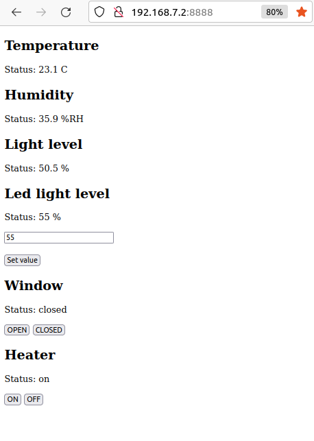

# Embedded operating systems course
Assignments on the Beaglebone Black board.The system is hosted on a Beaglebone Black running Debian OS with changes meant for the Beaglebone black hardware.

## Assignment 1
CLI application in Bash to control led 4 leds on the Beaglebone Black using different modes.

## Assignment 2
CLI application in C++ to control the brightness of a LED

## Assignment 3

The project is a greenhouse monitoring system that tracks temperature, humidity and light level.  The environment is monitored with sensors connected to the Beaglebone. The Beaglebone hosts a Node.js server that serves a website with the sensor data displayed and some controls for led light, window open position with a servo or a heater being on or off. The node.js server has a socket connection to the website client and constantly updates the values on the client.

Bellow is how the website looks like.

Old picture of cabling i found

Please look at the "EOS Assignment 3 Report.pdf" for more details.

### Some compilation stuff bellow:

--- Build c++ file
arm-linux-gnueabihf-g++ main.cpp tempHum/hih8120.cpp tempHum/hih8120.h I2CDevice.cpp I2CDevice.h photosensor/photoresistor.cpp photosensor/photoresistor.h heater/Heater.cpp heater/Heater.h pwm/pwm.cpp pwm/pwm.h -o greenhouse

--- Before starting node server, run the port forwarding script on the beaglebone

--- Start node server
node server.js

